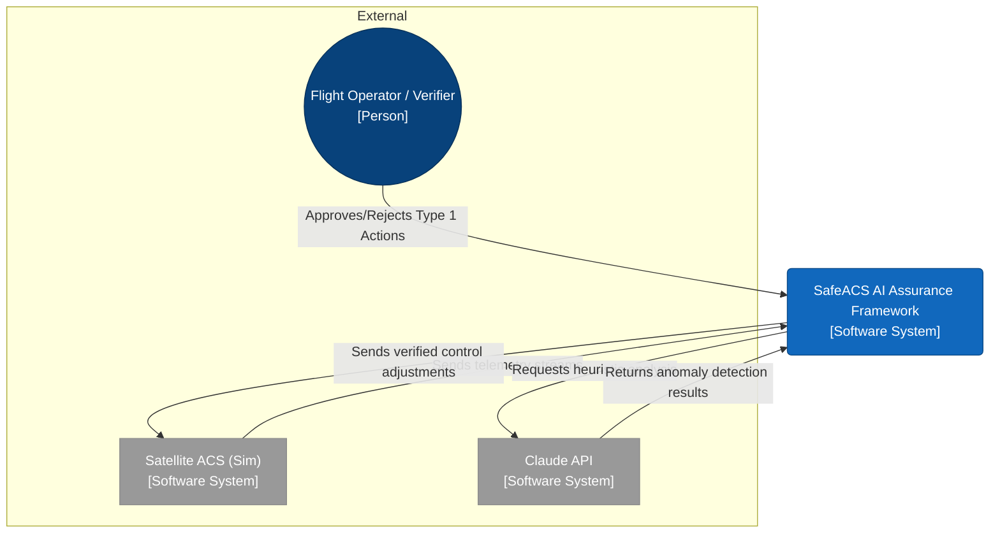
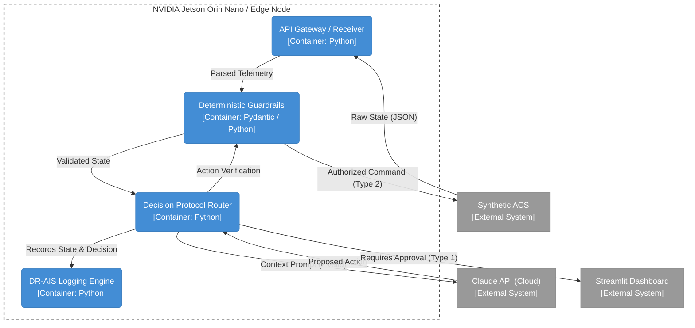
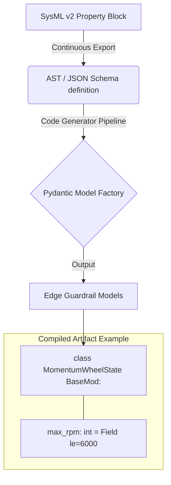

# ARCHITECTURE.md

## Executive Summary
The Cyber-Physical AI Assurance Framework (SafeACS) integrates Anthropic's steerable AI models (Claude) with mission-critical cyber-physical systems via an NVIDIA Jetson Orin Nano edge-compute node. Designed to operate within zero-requirements-drift aerospace constraints, SafeACS enforces deterministic safety boundaries using auto-generated Pydantic guardrails derived directly from SysML v2 property blocks. This architecture ensures all heuristic anomalies detected by Claude are verified against hard structural limits in under 50ms at the edge, maintaining absolute safety, bidirectionally traceable compliance, and auditable proof of innocence before any control action reaches the Satellite Attitude Control System.

## C4 Model Diagrams

### Context Level

### Container Level

## SysML v2 to Pydantic Guardrail Mapping
**Concept:**
Structural constraints defined in Model-Based Systems Engineering (MBSE) tools via SysML v2 are directly compiled into runtime Pydantic models. This guarantees zero requirement drift.

**Architecture Mapping Flow:**

**Mechanism:** 
If systems engineering parameters change (e.g., maximum momentum wheel limit from `6000` to `5500` RPM), the CI/CD pipeline immediately regenerates the edge Pydantic guardrail. The LLM is mathematically incapable of issuing a command outside this deterministic bound that reaches the hardware.

## Interface Definitions
- **Synthetic ACS ↔ Jetson Edge:** High-frequency UDP or Local REST. Sending JSON payloads containing Gyro (X,Y,Z), Momentum Wheel RPMs, and Euler angles.
- **Jetson Edge ↔ Claude API:** Secure HTTPS REST using structured Anthropic Tool Schemas (JSON) bounding LLM outputs.
- **Jetson Edge ↔ Eval Pipeline:** Log streaming of all prompt/response pairs with edge validation timestamps to calculate cognitive latency and RoCS.

## Compliance Framework Mapping
| SafeACS Element           | Target Standard           | Justification / Traceability                                                       |
| :------------------------ | :------------------------ | :--------------------------------------------------------------------------------- |
| Determinsitic Guardrails  | DO-178C, FAA OPA          | Ensures Intent, Correctness, and Innocuity regardless of heuristic LLM variations. |
| Audit Logging (DR-AIS)    | IEEE 7000 / ISO 42001     | Provides transparency, accountability, and system management traceability.         |
| Boundary Testing & Evals  | NIST AI RMF 1.0 (Measure) | Quantifies anomaly detection success against a bounded fatal deviation rate.       |
| Bimodal Decision Protocol | MIL-STD-882               | Limits LLM autonomy on critical pathways based on quantitative hazard severities.  |
