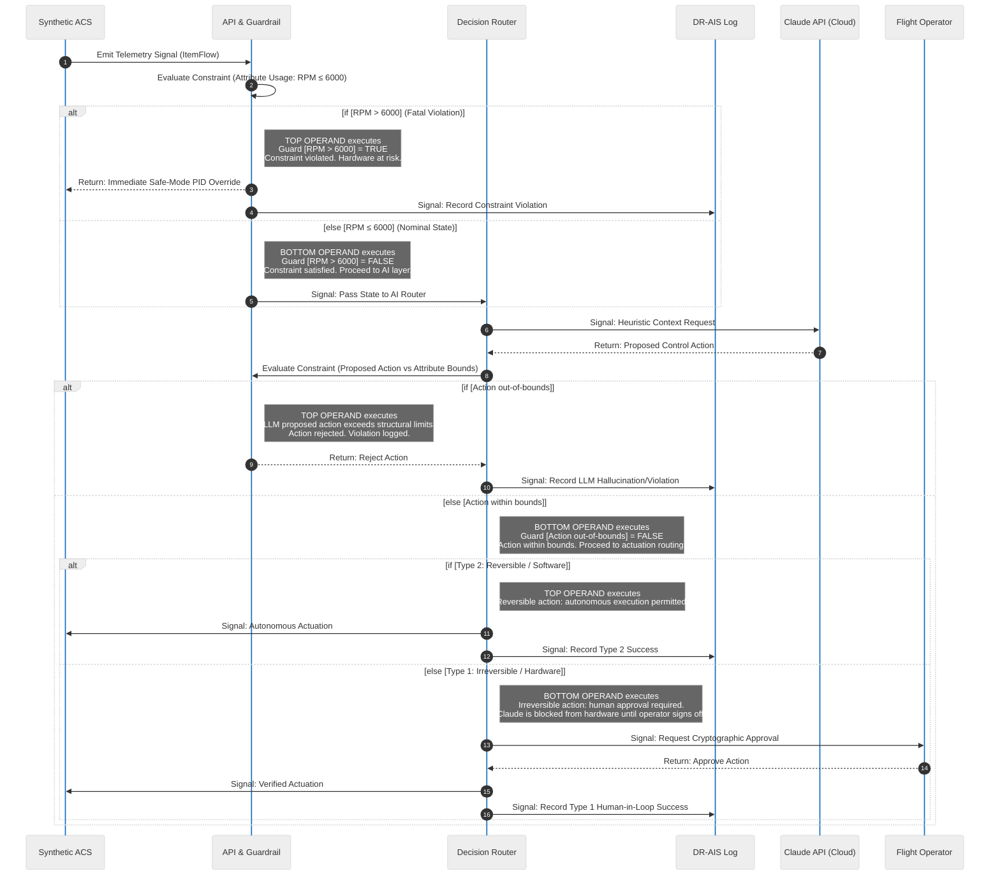

# ARCHITECTURE.md

## Executive Summary
The Cyber-Physical AI Assurance Framework (SafeACS) integrates Anthropic's steerable AI models (Claude) with mission-critical cyber-physical systems via an NVIDIA Jetson Orin Nano edge-compute node. Designed to operate within zero-requirements-drift aerospace constraints, SafeACS enforces deterministic safety boundaries using auto-generated Pydantic guardrails derived directly from SysML v2 property blocks. This architecture ensures all heuristic anomalies detected by Claude are verified against hard structural limits in under 50ms at the edge, maintaining absolute safety, bidirectionally traceable compliance, and auditable proof of innocence before any control action reaches the Satellite Attitude Control System.

## C4 Model Architecture Topologies

> [!NOTE] 
> **How to Read these Diagrams:**
> These diagrams represent **Data Flow & Structural Boundary Enforcement Topologies**, not state machines. They map the left-to-right flow of physical telemetry data as it passes through deterministic edge constraints, gets analyzed by a probabilistic heuristic engine (Claude), and is finally routed as a verified control action. Follow the directional arrows `--->` to trace the blast radius of any given signal.

### Context Level (Macro System Boundaries)

> **Interpretation (Context Level):**
> 1. Raw synthetic state data originates on the left (`Satellite ACS`).
> 2. It hits the `SafeACS` boundary where structural sanity checks occur.
> 3. `SafeACS` offloads anomaly detection to the `Claude API` (right).
> 4. If the LLM proposes an irreversible action, `SafeACS` halts and demands manual `Flight Operator` clearance.

### Container Level (Edge Execution Engine)

> **Interpretation (Container Level):**
> This isolates the NVIDIA Jetson Orin Edge Node logic.
> 1. **Signal Ingestion:** Telemetry enters the `API Gateway`.
> 2. **The Hard Boundary:** It immediately passes through `Deterministic Guardrails` (Pydantic constraints compiled from SysML). This is the zero-drift barrier.
> 3. **The Heuristic Pathway:** Valid data is routed by the `Decision Protocol Router` to the `Claude API` for context-aware inference.
> 4. **Bimodal Actuation:** Claude returns a proposed action. The router validates it against the Guardrails again. Reversible actions (Type 2) are passed to the hardware; irreversible actions (Type 1) require UI approval. All state is committed to the `DR-AIS` immutable log.

### System Behavior: The Bimodal Decision Protocol
To understand how SafeACS handles nominal versus critical AI interventions, trace the execution sequence below. This demonstrates how the deterministic edge strictly bounds the probabilistic LLM.

> **Interpretation (SysML v2 Sequence Semantics):**
> To ensure absolute rigor for safety-critical systems, this interaction operates under strict SysML v2 mapping:
> - **Participants (Nodes):** Represent architectural **Parts** typed by **PartDefinitions**. The `API & Guardrail`, `Decision Router`, and `DR-AIS Log` constitute the Edge Node boundary.
> - **Solid Lines (`->>`):** Represent asynchronous **Signal** transmissions passing via **ItemFlows** between parts.
> - **Dashed Lines (`-->>`):** Represent **Return** messages resulting from a previous invocation or sequence.
> - **Self-Arrows (Step 2, Step 6):** Represent internal **Behaviors** evaluating a **Constraint** against an **Attribute Usage** (the SysML v2 concept for quantifiable part characteristics, e.g. RPM) to determine if structural hardware limits are breached.
> - **`alt` Blocks:** Represent **Alternative Successions** — conditional `if`/`else` branching within SysML v2 Interactions. Each `alt` block is divided into exactly **two visual operand regions** by a dashed horizontal divider:
>   - **Top region** → executes when the first guard (shown in the header) evaluates to **True**
>   - **Bottom region** → executes when the first guard evaluates to **False** (the `else` fallthrough)
>   - Only **one** region will ever execute per occurrence. The other is completely bypassed.
> - **`Note` Annotations:** Contextual inline explanations within each operand region, clarifying which guard fired and what the architectural consequence is.
> - **`[Guards]`:** Boolean expressions evaluated at decision points. Guards are shown in the header of each `alt` region in square brackets (e.g. `[if RPM > 6000]`). If the guard evaluates to False, all steps within that region are skipped and execution falls through to the `else` operand.
> - **Numbers (`1, 2, 3...`):** Denote the exact, deterministic chronological **Sequence** of execution.

## SysML v2 to Pydantic Guardrail Mapping

> [!IMPORTANT]
> **The Zero-Drift Principle:** Structural constraints defined in Model-Based Systems Engineering (MBSE) tools via SysML v2 are directly and automatically compiled into runtime Pydantic models. This guarantees absolute zero-requirement drift between the physics model and the executing code.

**Architecture Mapping Flow:**

**Mechanism:** 
If systems engineering parameters change (e.g., maximum momentum wheel limit from `6000` to `5500` RPM), the CI/CD pipeline immediately regenerates the edge Pydantic guardrail. The LLM is mathematically incapable of issuing a command outside this deterministic bound that reaches the hardware.

## Interface Definitions
- **Synthetic ACS ↔ Jetson Edge:** High-frequency UDP or Local REST. Sending JSON payloads containing Gyro (X,Y,Z), Momentum Wheel RPMs, and Euler angles.
- **Jetson Edge ↔ Claude API:** Secure HTTPS REST using structured Anthropic Tool Schemas (JSON) bounding LLM outputs.
- **Jetson Edge ↔ Eval Pipeline:** Log streaming of all prompt/response pairs with edge validation timestamps to calculate cognitive latency and RoCS.

## Compliance Framework Mapping
| SafeACS Element           | Target Standard           | Justification / Traceability                                                       |
| :------------------------ | :------------------------ | :--------------------------------------------------------------------------------- |
| Determinsitic Guardrails  | DO-178C, FAA OPA          | Ensures Intent, Correctness, and Innocuity regardless of heuristic LLM variations. |
| Audit Logging (DR-AIS)    | IEEE 7000 / ISO 42001     | Provides transparency, accountability, and system management traceability.         |
| Boundary Testing & Evals  | NIST AI RMF 1.0 (Measure) | Quantifies anomaly detection success against a bounded fatal deviation rate.       |
| Bimodal Decision Protocol | MIL-STD-882               | Limits LLM autonomy on critical pathways based on quantitative hazard severities.  |
