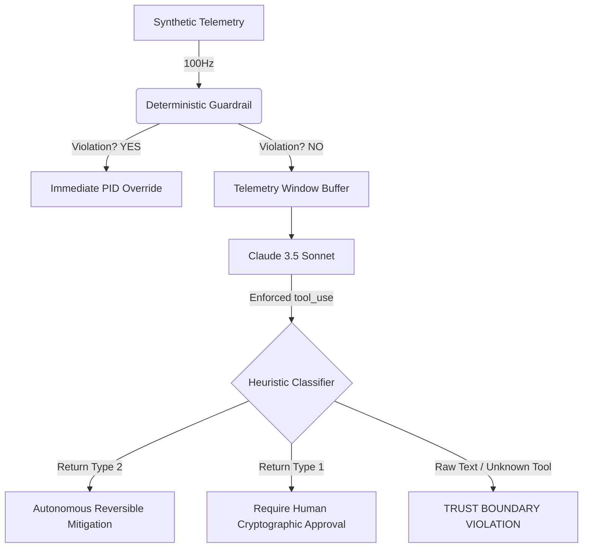

# Process Build Log: Cyber-Physical AI Assurance Framework

## Architectural Reasoning

SafeACS solves the "LLM Hallucination" problem in physical engineering via strict execution isolation (The "Bimodal Architecture"):

*   **Layer 1: The Deterministic Bound:** Written in pure Python (compiled directly from SysML v2 property blocks). Runs on the edge node at 100Hz. This layer represents the immutable laws of physics for the satellite. No LLM runs here.
*   **Layer 2: The Cognitive Heuristic:** An Anthropic Claude model observing the telemetry window out-of-band. It detects micro-deviations that PID loops miss, but it cannot actuate hardware directly.

### 🧠 The Trust Boundary

To bridge the gap between probabilistic LLM output and deterministic execution, SafeACS enforces a rigorous Trust Boundary using `tool_use`.

### The Iron Wall (LLM Constraint)
We do not configure Claude using just a system prompt. Prompt injections are inevitable. Instead, the `decision_router` enforces Anthropic's Tool Use API dynamically. If the LLM generates plain text or a hallucinated tool execution instead of strictly invoking `report_anomaly_analysis`, the Python router traps the exception, classifies it as a `LLM_TRUST_BOUNDARY_VIOLATION`, and alerts a human operator. The LLM's hallucination is contained conceptually and chronologically.

## 📊 Return on Cognitive Spend (RoCS)
We treat LLM inference as a system resource with a latency and financial cost.

By logging every `DecisionEvent` through the `dr_ais_logger.py` asynchronously, we can compute the RoCS offline:
`RoCS = (Actionable Anomaly Detections) / (Total Tokens / 1000)`

This allows system architects to mathematically justify the inclusion of an LLM in the loop versus traditional rule-based statistical anomaly detection.
