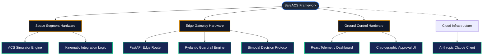

# SafeACS Critical Design Review (CDR) Retrospective

**Review Date:** Q1 2026  
**System of Interest:** Cyber-Physical AI Assurance Framework (SafeACS)  
**Standard Reference:** NASA Systems Engineering Handbook (SP-2016-6105), Rev. 2 / DoDI 5000.88 

## 1. Executive Summary
This document serves as a retrospective Critical Design Review (CDR) for the SafeACS project. It formalizes the systems engineering methodology utilized to transition the project from high-level stakeholder needs down to verifiable physical and software component allocations. 

The CDR confirms that the detailed design satisfies the system requirements established in `RTM.md` and adequately mitigates the severity thresholds identified in `HAZARDS.md` while remaining within the Size, Weight, and Power (SWaP) constraints of the Edge Node environment.

## 2. The "V" Model Traceability

In accordance with standard aerospace Systems Engineering "V" models, the SafeACS architecture was derived via rigorous left-side decomposition:

1.  **Stakeholder Needs:** The overarching need was to safely deploy advanced, probabilistic Large Language Models (LLMs) into the command loops of critical Space Vehicle (SV) hardware. Classical LLMs present unacceptable, non-deterministic risks (hallucinations, prompt injection) that could lead to catastrophic kinetic loss (e.g., spinning a momentum wheel beyond structural limits).
2.  **System Functions:** To satisfy this need, the primary system function was identified: *Enforce absolute, deterministic mathematical bounds on all commands traversing the interface between the LLM and the physical actuators, with zero tolerance for requirements drift.*
3.  **Component Allocation:** This function was allocated to a physical hardware chokepoint (NVIDIA Jetson Orin Nano Edge Gateway) running auto-generated, deterministic software (Pydantic schemas compiled from SysML v2 property limits).

## 3. Systems Decomposition (Block Definition)

The following diagram illustrates the formal decomposition of the SafeACS system into discrete configuration items (hardware and software). It operates as a SysML Block Definition Diagram (BDD).

## 4. Functional Allocation & Interface Control

The decomposition above allows us to map specific operational functions back to the physical allocations where they execute:

| System Function | Allocated To | Safety Criticality | Latency Constraint |
| :--- | :--- | :--- | :--- |
| **High-Frequency Ingestion** | FastAPI Edge Router (H2/S3) | Moderate | < 100ms |
| **Constraint Validation** | Pydantic Guardrails (H2/S4) | **Catastrophic** | < 10ms |
| **Heuristic Evaluation** | Claude Client (I1/S8) | Minor | N/A (Async Offload) |
| **Action Arbitration** | Bimodal Protocol (H2/S5) | **Catastrophic** | < 10ms |
| **Cryptographic Signoff** | React Dashboard (H3/S7) | Major | Human-in-the-loop |

## 5. Architectural Trade-offs & Critical Decisions

A successful CDR mandates a defense of design choices. Two critical architectural trade-offs defined the SafeACS framework:

### Trade-off 1: Edge Validation vs. Cloud Validation
*   **Alternative:** Send all telemetry directly to the cloud, allow the LLM to process it, and have the cloud validate the constraints before returning a command.
*   **Decision:** Constraints must be evaluated at the *Edge* (Jetson Node).
*   **Justification:** Cloud validation introduces unacceptable latency risks (network partitioning, API timeouts). More importantly, evaluating limits adjacent to the physical hardware ensures the "Assurance Boundary" cannot be bypassed by an adversary poisoning the external network connection.

### Trade-off 2: SysML v2 Direct Execution vs. Manual Translation
*   **Alternative:** Systems engineers write SysML constraint blocks, hand a PDF to software engineers, who manually write Python `if/else` statements.
*   **Decision:** The runtime code (`acs_simulator.py` and `guardrails.py`) must dynamically compile their limits directly from the digital twin parameters.
*   **Justification:** Manual translation introduces "Requirements Drift"—the number one cause of cyber-physical failures. By ensuring the executable code intrinsically mirrors the MBSE model, SafeACS structurally eliminates translation errors.
