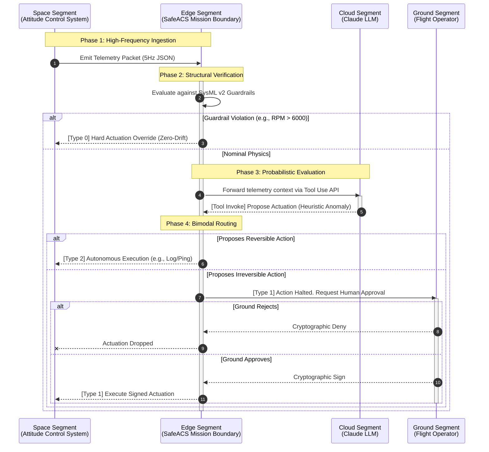

# UAF Op-Pr: Operational Processes

**Former DoDAF Equivalent:** OV-5b (Operational Activity Model)  
**UAF Domain:** Operational  
**UAF Model Kind:** Processes (Op-Pr)

## Process Context
The Operational Processes (Op-Pr) model describes the exact sequence of activities, behavioral flows, and data exchanges conducted to achieve the mission objective.

For **SafeACS**, this sequence maps the flow of a single telemetry packet from the physical hardware (Space Segment), through the Mission Assurance Boundary (Edge Segment), out to the probabilistic AI (Cloud Segment), and finally through the deterministic Bimodal Actuation Protocol.

---

## Operational Activity Flow (Bimodal Protocol)

## Traceability to Design Specifications

To satisfy the DoD Mission Engineering Guide (MEG) requirement for an unbroken "Digital Thread," the activities in this sequence map directly to our specific engineering artifacts:

1. **Phase 2 (Structural Verification)** directly mitigates **Hazard H-02 (Hardware Limit Exceedance)** as defined in [`HAZARDS.md`](../HAZARDS.md).
2. **Phase 4 (Bimodal Routing)** fulfills **Requirement REQ-SEC-01 (Type 1 Cryptographic Approval)** as defined in [`RTM.md`](../RTM.md).
3. The underlying physics constraints evaluated in Phase 2 are derived structurally from the MBSE properties in [`acs_behavior.sysml`](../models/acs_behavior.sysml).
